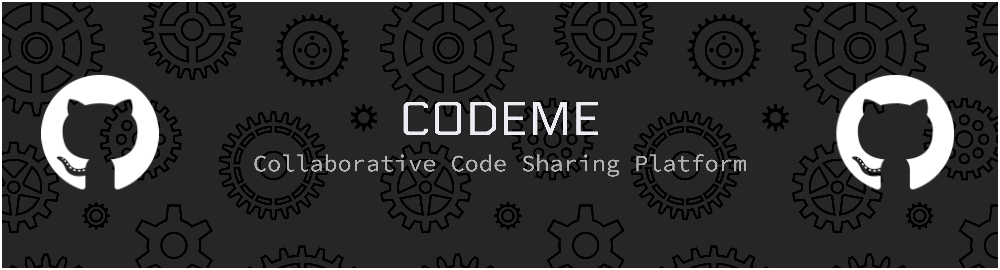

# CodeMe - Collaborative Code Sharing Platform (PWA)

A modern, real-time collaborative code sharing platform with Progressive Web App (PWA) capabilities. CodeMe enables developers to share, collaborate, and work together on code projects in real-time with offline support and installable app experience.

## ✨ Features

### 🚀 Core Features

- **Real-time Collaboration**: Multiple users can edit code simultaneously
- **Syntax Highlighting**: Support for multiple programming languages
- **File Management**: Create, edit, and organize files in a collaborative environment
- **Room-based Editing**: Create dedicated rooms for different projects

### 📱 PWA Features

- **Offline Support**: Work on your code even without internet connection
- **Installable**: Install CodeMe on your device for a native app experience
- **Responsive Design**: Works seamlessly on desktop, tablet, and mobile devices
- **Push Notifications Ready**: Infrastructure for future notification features
- **Fast Loading**: Optimized for quick startup and smooth performance

## 🛠️ Technology Stack

- **Frontend**: Next.js 15 with App Router
- **Code Editor**: CodeMirror 6 for powerful code viewing and editing
- **Real-time Sharing**: Yjs for CRDT-based collaborative sharing and editing
- **Real-time Communication**: WebSockets for instant code sharing
- **PWA**: Service Workers and Web App Manifest for offline sharing
- **Styling**: Tailwind CSS with custom components
- **Code Editor Themes**: CodeMirror Community Themes for beautiful code display
- **State Management**: Jotai for reactive state synchronization
- **TypeScript**: Full type safety throughout the application

## 🚀 Getting Started

### Prerequisites

- Node.js 18.0 or later
- npm, yarn, pnpm, or bun

### Installation

1. **Clone the repository**

   ```bash
   git clone <repository-url>
   cd codeme/client
   ```

2. **Install dependencies**

   ```bash
   npm install
   # or
   yarn install
   # or
   pnpm install
   ```

3. **Run the development server**

   ```bash
   npm run dev
   # or
   yarn dev
   # or
   pnpm dev
   ```

4. **Open your browser**
   Navigate to [http://localhost:3000](http://localhost:3000) to see the application.

## 📱 PWA Installation

### Desktop (Chrome/Edge/Opera)

1. Open the application in your browser
2. Click the install icon (📥) in the address bar
3. Click "Install" to add CodeMe to your desktop

### Mobile (Chrome/Android)

1. Open the application in Chrome
2. Tap the menu (⋮) and select "Add to Home screen"
3. Tap "Add" to install the app

### iOS Safari

1. Open the application in Safari
2. Tap the share button (📤)
3. Scroll down and tap "Add to Home Screen"
4. Tap "Add" to install the app

## 🌐 Offline Usage

Once installed as a PWA, CodeMe works offline:

1. **Offline Editing**: Continue editing your files without internet
2. **Automatic Sync**: Changes sync automatically when connection is restored
3. **Cached Resources**: All necessary assets are cached for offline use

## 📁 Project Structure

```
client/
├── public/                 # Static assets and PWA files
│   ├── manifest.json      # PWA manifest
│   ├── sw.js             # Service worker
│   └── *.png             # App icons
├── src/
│   ├── app/              # Next.js app router
│   │   ├── layout.tsx    # Root layout with PWA meta tags
│   │   └── page.tsx      # Main landing page
│   ├── components/       # React components
│   ├── hooks/           # Custom React hooks
│   ├── lib/             # Utility functions
│   │   ├── sw-register.js # Service worker registration
│   │   └── utils.ts     # Common utilities
│   ├── store/           # State management
│   └── types/           # TypeScript type definitions
├── next.config.ts       # Next.js configuration
└── package.json         # Dependencies and scripts
```

## 🔧 Configuration

### PWA Configuration

The PWA is configured through:

- [`public/manifest.json`](public/manifest.json) - App manifest with icons and metadata
- [`public/sw.js`](public/sw.js) - Service worker for offline functionality
- [`src/app/layout.tsx`](src/app/layout.tsx) - PWA meta tags and service worker registration

### Customization

To customize the PWA:

1. Update `manifest.json` with your app name, colors, and icons
2. Modify the service worker in `sw.js` for custom caching strategies
3. Adjust PWA meta tags in `layout.tsx`

## 🚀 Deployment

### Build for Production

```bash
npm run build
npm start
```

## 🤝 Contributing

1. Fork the repository
2. Create a feature branch (`git checkout -b feature/amazing-feature`)
3. Commit your changes (`git commit -m 'Add amazing feature'`)
4. Push to the branch (`git push origin feature/amazing-feature`)
5. Open a Pull Request

## 📝 License

This project is licensed under the MIT License.

## 🙏 Acknowledgments

- [Next.js](https://nextjs.org/) for the amazing React framework
- [CodeMirror 6](https://codemirror.net/) for the powerful and extensible code viewing and editing
- [Yjs](https://yjs.dev/) for CRDT-based real-time sharing and collaboration framework
- [CodeMirror Community Themes](https://github.com/codemirror/theme) for beautiful code display themes
- [Tailwind CSS](https://tailwindcss.com/) for the utility-first CSS framework
- [Jotai](https://jotai.org/) for atomic state synchronization
- The PWA community for inspiration and best practices

## 🆘 Support

If you encounter any issues or have questions:

1. Check the [Issues](https://github.com/kaushald4/codeme/issues) page
2. Create a new issue if needed

---

Made with ❤️ for collaborative coding
